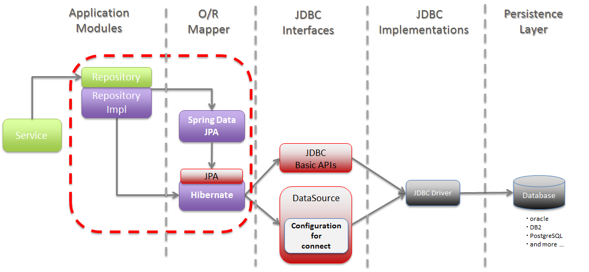

# JPA (Java Persistence API)


- 자바 ORM(Object-relational mapping) 기술의 표준 명세
- 자바 어플리케이션에서 관계형 데이터베이스를 사용하는 방식을 정의한 인터페이스
- 기존 EJB에서 제공되던 엔티티 빈을 대체하는 기술
- 자바 클래스와 DB테이블을 매핑


***

## 문법

### @Entity
- 데이타베이스의 <b>테이블과 일대일로 매칭되는 객체 단위</b>
- Entity 객체의 인스턴스 하나가 테이블에서 하나의 레코드 값
- 먼저 Spring Boot 를 설정할때 spring.jpa.hibernate.ddl-auto 설정이 create 혹은 update 로 되어 있을 경우 Spring 프로젝트가 시작될때 <b>EntityManager 가 자동으로 DDL 을 수행해 테이블을 생성</b>
- name 속성을 이용해 데이타베이스상의 실제 테이블 명칭을 지정하지 않는다면 Entity 클래스의 이름 그대로 CamelCase 를 유지한채 테이블이 생성
- <b>UnderScore 를 이용한 테이블 명명 규칙</b>을 이용하는 것이 좋습니다

```java
@Entity
public class Organization {
    ...
}

@Entity(name = "employee")
public class Employee {
    ...
}

@Entity(name = "employee_address")
public class EmployeeAddress {
    ...
}
```


### @Column
- <b>데이타베이스의 테이블에 있는 컬럼과 동일하게 1:1로 매칭</b>되기 때문에 Entity 클래스안에 내부변수로 정의
- Entity 클래스에 정의된 모든 내부변수는기본적으로 @Column 어노테이션을 포함
- Spring Boot 의 spring.jpa.hibernate.ddl-auto 설정이 create 혹은 update 로 되어 있을 경우 create 일때는 최초에 한번 컬럼이 생성이 되고, update 일때는 Entity 클래스에 있지만 해당 테이블에 존재하지 않는 컬럼을 추가로 생성
- UnderScore 형식으로 name 을 명시적으로 작성
- name은 실제 DB 컬럼 이름! 
- insertable=false, updatable=false:  특정 칼럼을 제외하고 save하는 방법
    - 쿼리에서 제외된 칼럼은 DB에 지정된 default값으로 삽입

```java
@Column 
private String code;

@Column(length = 100)
private String name;

//@Column 은 생략이 가능합니다.
private String description; 

@Column(precision = 11, scale = 2)
private BigDecimal amount;

@Column
private Integer size;

@Column(name = "register_date")
private LocalDateTime registerDate;

@Column(name = "default_field", insertable=false, updatable=false)
private String defaultField;
```

### @Id
- <b>PK (Primary Key)</b>
- Entity 클래스 상에 해당 PK 를 명시적으로 표시를 해야 되는데 그것을 @Id 어노테이션을 이용해 이것이 PK 임을 지정
```java
@Id
@Column
private String code;
```

### @GeneratedValue
- 데이타 경합으로 인해 발생되는 데드락 같은 현상을 방지 하기 위해 대부분 BigInterger 즉 Java 의 Long 을 주로 사용

- <b>auto increment</b>
    - 숫자형의 PK 컬럼 속성을 auto increment 로 지정하면 자동으로 새로운 레코드가 생성이 될때마다 마지막 PK 값에서 자동으로 +1 을 해주는 방식
    - <b>GenerationType.IDENTITY</b> 로 지정해 auto increment 컬럼인 것을 EntityManager 에 알려줍니다.
    ```java
    @Id
    @GeneratedValue(strategy = GenerationType.IDENTITY)
    private Long id;
    ```
- <b>sequence</b>
    - sequence ORACLE 객체를 생성해 두고 해당 sequence 를 호출할때마다 기존 값의 +1 이 된 값을 반환해 주는 방식
    - <b>GenerationType.SEQUENCE</b> 로 지정해 sequence 를 사용해 PK 값을 사용하겠다고 지정
    ```java
    @Id
    @SequenceGenerator(name="seq", sequenceName="jpa_sequence")
    @GeneratedValue(strategy=GenerationType.SEQUENCE, generator="seq")
    private Long id;
    ```

### @EmbeddedId
- 일반적인 경우에는 PK 를 단일 @Id 로 구성하지만 경우에 따라선 <b>복합키</b>로서 테이블의 PK 를 정의
- <b>복합키는 두개 이상의 @Id 로 구성이 되는데 이를 직접 Entity 에 정의하는 것이 아니라 별도의 Value 를 사용해 복합키를 정의</b>
- 이 Entity 에 해당 Value 를 PK 로 사용한다고 지정
```java
@Embeddable
public class CompanyOrganizationKey implements Serializable {
	@Column(name = "company_code")
    private String companyCode;
    
    @Column(name = "organization_code")
    private String organizationCode;
}

@Entity(name = "company_organization")
public class CompanyOrganization {
    @EmbeddedId
    protected CompanyOrganizationKey companyOrganizationKey;
}
```

### @DynamicInsert, DynamicUpdate
- insert,update 시 null 인필드 제외
```java
@Entity
@Getter
@Table(name = "Post")
@DynamicInsert
@NoArgsConstructor
public class Post {
    ...    
}
```


### @Enumerated
- java 의 <b>enum 형태로 되어 있는 미리 정의되어 있는 코드 값이나 구분값을 데이타 타입으로 사용</b>하고자 할때 사용
- EnumType.ORDINAL, enum 객체에 정의된 순서가 컬럼의 값으로 사용
- EnumType.STRING, enum 의 문자열 자체가 컬럼의 값으로 사용
```java
enum FlagYN {
    Y, N
}

@Enumerated(EnumType.ORDINAL)
@Column(name = "access_yn")
private FlagYN accessYn; //0, 1 이 값으로 저장

@Enumerated(EnumType.STRING)
@Column(name = "use_yn", length = 1)
private FlagYN useYn; //'Y', 'N' 이 값으로 저장
```


### @Transient
- Entity 객체에 속성으로서 지정되어 있지만 데이타베이스상에 필요없는 속성일 경우 사용
- 해당 속성을 데이타베이스에서 이용하지 않겠다 라고 정의
```java
@Transient
private String tempValue;
```

***

## 관계

### @OneToOne
- 데이타베이스 상의 1:1 관계를 의미
- 부모 Entity 객체에 정의된 PK 와 자식 Entity 객체에 정의된 FK 를 기준으로 정의
- @OneToOne 어노테이션이 위치하는 곳은 기본적으로 <b>FK 가 있는쪽 즉, 자식 Entity 객체쪽</b>
```java
@Entity(name = "parent")
public class Parent {
    @Id
    @GeneratedValue(strategy = GenerationType.IDENTITY)
    private Long id; //여기는 parent 의 id
}

@Entity(name = "child")
public class Child {
    @Id
    @GeneratedValue(strategy = GenerationType.IDENTITY)
    private Long id; //여기는 child 의 id 
    
    @OneToOne
    @JoinColumn(name = "parent_id") //child 에 지정되어 있는 FK parent_id 기준으로 parent 조회 
    private Parent parent;
}
```
- OneToOne 관계를 맺었을때 디폴트 설정으로 FetchType 이 EAGER 로 설정되어 있어 자식 Entity 를 조회 했을때 자동으로 부모Entity 를 조회한다.
- FetchType 을 LAZY 로 지정하면 지정된 Entity 객체를 미리 가지고 있는 것이 아니라 Entity 객체를 사용하려고 할때 그 즉시 데이타를 데이타베이스에서 가지고 온다.
```java
@Entity(name = "parent")
public class Parent {
    @Id
    @GeneratedValue(strategy = GenerationType.IDENTITY)
    private Long id; //여기는 parent 의 id
}

@Entity(name = "child")
public class Child {
    @Id
    @GeneratedValue(strategy = GenerationType.IDENTITY)
    private Long id; //여기는 child 의 id 
    
    @OneToOne(fetch = FetchType.LAZY) //사용시점에 조회가 됨
    @JoinColumn(name = "parent_id") //child 에 지정되어 있는 FK parent_id 기준으로 parent 조회 
    private Parent parent;
}
```


### @SecondaryTable
- 1:1 관계중 자식 Entity 객체의 모든 값을 사용할 필요 없이 필요한 자식 Entity 의 값을 부모 Entity 에서 사용하게 하는 방법
- @SecondaryTable 이 정의된 Entity 를 조회할때 내부적으로 데이타를 join 해서 parent 와 child 의 데이타를 합쳐서 가지고 오기 때문에 속도면에서도 조금은 유리
- name 속성은 자식 테이블의 이름의 의미하며 pkJoinColumns 속성은 부모 테이블과 자식 테이블간의 join 설정
- 이때 @PrimaryKeyJoinColumn 어노테이션을 이용해 name 속성에 자식 테이블의 FK 이름을 referencedColumnName 속성에 부모 테이블의 PK 이름을 명시
```java
@Entity(name = "parent")
@SecondaryTable(
    name = "child",
    pkJoinColumns = @PrimaryKeyJoinColumn(name="parent_id", referencedColumnName="id")
)
public class Parent {
    @Id
    @GeneratedValue(strategy = GenerationType.IDENTITY)
    private Long id; //여기는 parent 의 id
    
    @Column(name = "name", table = "child")
	private String childName;
}
```
- 필요하다면 @SecondaryTable 을 1:1 로서 하나의 자식 Entity 와 관계를 맺을 수 있는 것이 아니라 다중 Entity 와도 관계를 맺을 수 있습니다.
```java
@Entity(name = "parent")
@SecondaryTables({
    @SecondaryTable(
        name = "child",
        pkJoinColumns = 
        	@PrimaryKeyJoinColumn(name="parent_id", referencedColumnName="id")
    ),
    @SecondaryTable(
        name = "detail",
        pkJoinColumns = 
        	@PrimaryKeyJoinColumn(name="parent_id", referencedColumnName="id")
    )
})
public class Parent {
    @Id
    @GeneratedValue(strategy = GenerationType.IDENTITY)
    private Long id; //여기는 parent 의 id
    
    @Column(name = "name", table = "child")
	private String childName;
    
    @Column(name = "name", table = "detail")
	private String detailName;
}
```

### @ManyToOne
- <b>자식 Entity 객체에서 부모 Entity 객체를 바라볼때 사용</b>
- @ManyToOne 어노테이션이 위치하는 곳은 <b>FK 가 있는 자식 Entity 객체쪽</b> 
- FetchType 의 디폴트 값은 EAGER 로서 자식 Entity 가 조회됨과 동시에 부모 Entity 를 조회. 먄약 부모 Entity 를 바로 사용하지 않는다면 속도를 위해 FetchType 을 LAZY 로 설정.
```java
@Entity(name = "parent")
public class Parent {
    @Id
    @GeneratedValue(strategy = GenerationType.IDENTITY)
    private Long id;
}

@Entity(name = "child")
public class Child {
    @Id
    @GeneratedValue(strategy = GenerationType.IDENTITY)
    private Long id;
    
    @ManyToOne
    @JoinColumn(name = "parent_id")
    private Parent parent;
}
```


### @OneToMany
- 데이타를 바라보는 주체가 부모 Entity 이며 <b>하나의 부모 Entity 데이타와 연관이 있는 여러개의 자식 Entity 데이타를 사용 하겠다는 의미로서 <u>가장 많이 사용하는 어노테이션</u></b>
- 부모 Entity 에서 @OneToMany 어노테이션을 지정
- JPA 관계 중 유일하게 FK 가 위치한 자식 Entity 가 아닌 부모 Entity 에 어노테이션이 위치
- 기본적으로 FetchType 설정이 LAZY 로 설정되어 있음
```java
@Entity(name = "parent")
public class Parent {
    @Id
    @GeneratedValue(strategy = GenerationType.IDENTITY)
    private Long id;
    
    @OneToMany
    @JoinColumn(name = "parent_id") //child 테이블에 있는 parent_id FK 
    private List<Child> childList;
}

@Entity(name = "child")
public class Child {
    @Id
    @GeneratedValue(strategy = GenerationType.IDENTITY)
    private Long id;
}
```

### @ElementCollection
- OneToMany 관계에서 자식 Entity 에 있는 모든 값을 가지고 오는 것이 아니라 필요한 속성의 값만 가지고와서 Collection 으로 구성할 수 있는 기능을 제공
- 또한 @Embeddable 로 지정된 Value 객체를 이용해 값을 가지고 옴
- @CollectionTable 어노테이션의 name 속성에 자식 테이블의 이름을 명시하고 joinColumns 속성에 @JoinColumn 으로 정의한 자식 테이블의 FK 를 지정
- @Column 어노테이션의 name 속성에 지정되는 이름은 자식 테이블의 컬럼명
```java
@Entity(name = "parent")
public class Parent {
    @Id
    @GeneratedValue(strategy = GenerationType.IDENTITY)
    private Long id;
    
    @ElementCollection
    @CollectionTable(
        name = "child",
        joinColumns = @JoinColumn(name = "parent_id")
    )
    @OrderColumn(name = "id")
    @Column(name = "name")
    private List<String> childNameList;
}
```
- @MapKeyColumn 어노테이션을 이용해 Map 의 Key 에 해당되는 컬럼을 @Column 을 이용해 Map 의 Value 에 해당되는 컬럼을 지정하며 Map Collection 에 값을 가지고 올 수 있다.
```java
@Entity(name = "parent")
public class Parent {
    @Id
    @GeneratedValue(strategy = GenerationType.IDENTITY)
    private Long id;
    
    @ElementCollection
    @CollectionTable(
        name = "child",
        joinColumns = @JoinColumn(name = "parent_id")
    )
    @MapKeyColumn(name = "id")
    @Column(name = "name")
    private Map<Long, String> childNameMap;
}
```

### @ManyToMany
- @JoinTable 어노테이션의 name 속성으로 중간 맵핑 테이블을 정의
- 중간 맵핑 테이블로 부모 Entity 와 자식 Entity 간의 관계를 알 수 있으며 다른 관계와는 다르게 부모와 자식 Entity 가 동등한 위치이기 때문에 자식 Entity 의 FK 는 존재하지 않으며 중간 맵핑 테이블에 부모 Entity 의 PK 와 자식 Entity 의 PK 가 둘다 존재
- 데이타베이스상에 표현할 수 없는 관계이며 JPA 상에서 논리적으로만 표현
- @ManyToMany 를 표현할 수 있는 맵핑 테이블을 생성해 서로의 PK 가지고 관계를 설정 하게 되며 중간 맵핑 테이블은 JPA 상에서 숨겨져서 표현
```java
@Entity(name = "parent")
public class Parent {
    @Id
    @GeneratedValue(strategy = GenerationType.IDENTITY)
    private Long id;
    
    @ManyToMany
    @JoinTable(
        name = "parent_child",
        joinColumns = @JoinColumn(name = "parent_id"),
        inverseJoinColumns = @JoinColumn(name = "child_id")
    )
    private List<Child> childList;
}
```

***
***

## 참고 사이트

https://velog.io/@adam2/JPA%EB%8A%94-%EB%8F%84%EB%8D%B0%EC%B2%B4-%EB%AD%98%EA%B9%8C-orm-%EC%98%81%EC%86%8D%EC%84%B1-hibernate-spring-data-jpa
(개념)

https://jogeum.net/6
(문법)

https://jogeum.net/7?category=766565
(관계)